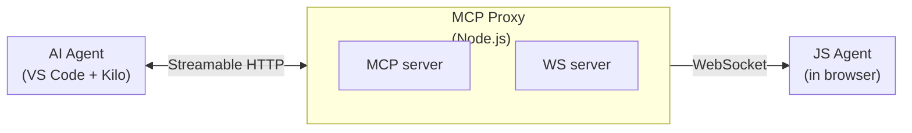

# mcp-reverse-engineering-toolkit

Platform for reverse-engineering websites through AI agents. Consists of two components:

- **MCP Proxy** — Node.js application acting as an MCP server (Streamable HTTP) for the AI agent and a WebSocket server for the JS agent in the browser.
- **JS Agent** — Browser-injected script that connects to MCP Proxy via WebSocket and executes AI agent commands in the website runtime.

---

## 1. Operating Modes

The project has **two modes** that define what the AI agent can and cannot do.

### 1.1. Core Development

**Allowed:** Modify files in `src/`, `tests/`, `scripts/`, and root configs (`package.json`, `AGENTS.md`, `.gitignore`).

**Goal:** Develop and improve the framework (MCP Proxy + JS Agent).

**Rules:**
- All code in `src/` must be covered by tests in `tests/` (minimum 80%)
- Run `npm test` after changes
- After changes in `src/js-agent/`, rebuild the bundle: `npm run build:agent`
- Follow Code Style (Section 5)
- Always increase js-agent minor version after implementing a change
- Do not use emoji in documents and code comments

### 1.2. Study Mode

**Allowed:** Create and modify files only inside `study/<project-name>/`.

**Forbidden:**
- Modify any files in `src/`, `tests/`, `scripts/`
- Modify root config files: `package.json`, `AGENTS.md`, `.gitignore`

**Exception:** If research reveals a need to improve the core framework, file it as a separate Core Development task.

**Full Study Mode workflow, MCP tools description, research techniques, and best practices are documented in [research-technics.md](research-technics.md).**

---

## 2. Architecture



### 2.1. MCP Proxy (`src/mcp-proxy/`)

MCP server with Streamable HTTP transport + built-in WebSocket server.

**MCP Tools:**

| Tool | Description |
|------|-------------|
| `read-dom` | Read page DOM (with optional CSS selector) |
| `execute-js` | Execute arbitrary JS in page context |
| `get-context` | Get data from JS agent (URL, cookies, localStorage, etc.) |
| `update-agent` | Update JS agent code (self-update) or get version |
| `execute-js-ext` | Read JS code from a file and execute it in the browser |
| `get-context-ext` | Execute JS in browser and save result to a file |

**File-based tools usage rules (Study Mode):**
- Use `execute-js-ext` when the JavaScript code to execute is too large to pass inline (e.g., complex data loaders or scrapers). Create the JS file in `study/<project-name>/` and pass its path.
- Use `get-context-ext` when the data extracted from the website is too large to return through the chat. The tool will overwrite the target file each time.
- When using `get-context-ext`, always generate a unique file path containing a timestamp to avoid overwriting previous extractions. Use the pattern: `study/<project-name>/data/<description>_<YYYYMMDD_HHMMSS>.json`
- The file passed to `get-context-ext` is always overwritten (not appended). This prevents data mixing from previous extractions.

**Logging system:**
- All logs are written to console and to `logs/mcp-proxy.log`
- Format: `[timestamp] [level] [tag] message (optional JSON)`
- Levels: `info`, `debug`, `warn`, `error`
- Tags: `MCP-Proxy`, `WS-Bridge`, `Tool:*`
- Graceful shutdown and uncaught exceptions are logged before termination
- To view: `type logs\mcp-proxy.log` (Windows) or `tail -f logs/mcp-proxy.log` (Linux/Mac)

### 2.2. JS Agent (`src/js-agent/`, built to `dist/js-agent-bundle.js`)

Browser-injected script. Connects to MCP Proxy via WebSocket and executes commands.

**Capabilities:**
- Connect / reconnect with exponential backoff (1s -> 2s -> 4s -> ... -> 60s)
- Safe JS execution (try/catch + stack trace + timeouts)
- Self-update via UPDATE_AGENT command
- Keepalive (ping/pong every 30s)

### 2.3. Wire Protocol

Messages are transmitted as JSON strings over WebSocket.

```json
{ "type": "request", "id": "uuid", "command": "READ_DOM", "params": { "selector": "body" } }
{ "type": "response", "id": "uuid", "result": "<html>...</html>", "error": null }
{ "type": "response", "id": "uuid", "result": null, "error": { "message": "...", "stack": "..." } }
{ "type": "ping" }
{ "type": "pong" }
```

---

## 3. Project Structure

```
mcp-reverse-engineering-toolkit/
├── AGENTS.md               # Rules for AI agent
├── research-technics.md    # Study Mode workflow and research techniques
├── SETUP.md                # User instructions (non-developer)
├── package.json
├── .gitignore
├── logs/                   # MCP Proxy logs (.gitignore)
│   └── mcp-proxy.log       # Current log file
├── dist/
│   └── js-agent-bundle.js  # Built JS agent (copy to console)
├── src/
│   ├── mcp-proxy/          # MCP Proxy (Node.js)
│   │   ├── index.js
│   │   ├── websocket-bridge.js
│   │   ├── config.js
│   │   └── tools/
│   │       ├── read-dom.js
│   │       ├── execute-js.js
│   │       ├── get-context.js
│   │       ├── update-agent.js
│   │       ├── execute-js-ext.js
│   │       └── get-context-ext.js
│   └── js-agent/           # JS Agent sources (ES modules)
│       ├── index.js
│       ├── connection.js
│       ├── command-handler.js
│       ├── executor.js
│       └── self-update.js
├── tests/
│   ├── mcp-proxy/
│   │   └── websocket-bridge.test.js
│   └── js-agent/
│       ├── executor.test.js
│       └── command-handler.test.js
├── scripts/
│   ├── start.js            # Start MCP Proxy
│   └── build-agent.js      # Build JS agent bundle
└── study/                  # Research artifacts (.gitignore)
    └── .gitkeep
```

---

## 4. Code Style

- **Language:** JavaScript (ES modules), no TypeScript
- **Imports:** ES modules (`import`/`export`), no CommonJS (`require`)
- **Indentation:** 2 spaces
- **Asynchrony:** async/await, no callback style
- **Error handling:** try/catch at all boundaries (network, eval, IO)
- **Comments:** Do NOT write comments in code. Code should be self-documenting.
- **Naming:**
  - Files: lowerCamelCase.js (except entry points index.js)
  - Directories: kebab-case
  - Functions: lowerCamelCase
  - Constants: UPPER_SNAKE_CASE
  - Classes: UpperCamelCase
- **Line length:** No more than 100 characters
- **Strict mode:** "use strict" (automatic via ESM)


---

## 5. Testing

- **Framework:** Vitest
- **Structure:** `tests/<module>/<file>.test.js` mirrors `src/<module>/<file>.js`
- **Coverage:** Minimum 80% for core (`src/`)
- **Run:** `npm test`
- **Watch mode:** `npm run test:watch`

---

## 6. Security

- `.gitignore` includes `study/*` — research artifacts do not enter the repository
- `.env` in `.gitignore` — no secrets in code
- JS agent runs in the user's browser — no file system access
- Arbitrary JS execution in executor.js is always wrapped in try/catch
- WebSocket connections are limited to localhost by default

---

## 7. Dependencies

**Runtime:**
- `@modelcontextprotocol/sdk` — MCP server
- `ws` — WebSocket server + client
- `express` — HTTP server for Streamable HTTP transport

**Dev:**
- `vitest` — testing

---

## 8. Scripts

```bash
npm start              # Start MCP Proxy (port 3100)
npm test               # Run tests
npm run build:agent    # Build JS agent to dist/js-agent-bundle.js
```

---

## 9. Research Documentation

For detailed research skills, MCP tools usage, Study Mode workflow, and best practices, see [research-technics.md](research-technics.md).
