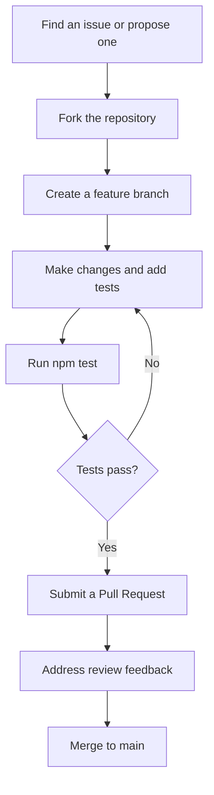
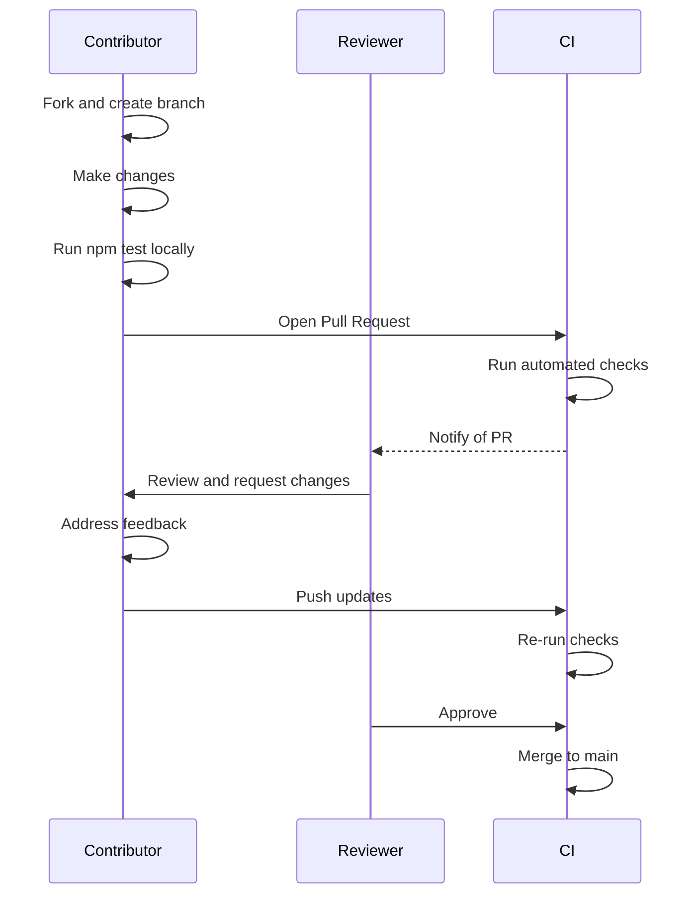

# Contributing to mcp-reverse-engineering-toolkit

Thank you for your interest in contributing to this project. This document provides guidelines and instructions for contributing.

## Table of Contents

- [How to Contribute](#how-to-contribute)
- [Getting Started](#getting-started)
- [Code Style](#code-style)
- [Testing Requirements](#testing-requirements)
- [Submitting Changes](#submitting-changes)
- [Reporting Bugs](#reporting-bugs)
- [Feature Requests](#feature-requests)

---

## How to Contribute

There are several ways to contribute to this project:

1. **Bug Reports** — Found a bug? Open an issue with a clear reproduction steps.
2. **Feature Requests** — Have an idea? Open an issue to discuss it before implementation.
3. **Documentation** — Improve README, SETUP, research-technics, or add code examples.
4. **Code Contributions** — Fix bugs, add features, or refactor existing code via pull requests.
5. **Tests** — Add or improve test coverage for existing functionality.

### Contribution Workflow



---

## Getting Started

### Prerequisites

- Node.js >= 18
- npm (bundled with Node.js)

### Setup

1. Fork the repository on GitHub.
2. Clone your fork locally:
   ```bash
   git clone https://github.com/<your-username>/mcp-reverse-engineering-toolkit.git
   cd mcp-reverse-engineering-toolkit
   ```
3. Install dependencies:
   ```bash
   npm install
   ```
4. Verify the setup by running the test suite:
   ```bash
   npm test
   ```
5. Start the MCP Proxy to verify everything works:
   ```bash
   npm start
   ```

### Project Structure

The project consists of two main components:

- **MCP Proxy** (`src/mcp-proxy/`) — Node.js application acting as an MCP server with Streamable HTTP transport and a WebSocket server.
- **JS Agent** (`src/js-agent/`) — Browser-injected script that connects to MCP Proxy and executes commands in the website runtime.

For full architecture details, see [AGENTS.md](AGENTS.md).

---

## Code Style

All contributions must follow the code style rules defined in [AGENTS.md](AGENTS.md). The key rules are summarized below:

### Language and Syntax

- **JavaScript only** — No TypeScript. The project uses plain JavaScript with ES modules.
- **ES modules** — Use `import`/`export` syntax. No CommonJS (`require`/`module.exports`).
- **Async/Await** — Use `async`/`await` for all asynchronous operations. No callback-style code.
- **Error handling** — Wrap all network, evaluation, and I/O operations in `try`/`catch` blocks.

### Formatting

- **Indentation** — 2 spaces (no tabs).
- **Line length** — Maximum 100 characters per line.
- **Strict mode** — Enabled automatically via ESM.

### Naming Conventions

| Element | Convention | Example |
|---------|-----------|---------|
| Files | lowerCamelCase.js | `commandHandler.js` |
| Directories | kebab-case | `mcp-proxy/` |
| Functions | lowerCamelCase | `handleRequest()` |
| Constants | UPPER_SNAKE_CASE | `MAX_RETRIES` |
| Classes | UpperCamelCase | `WebSocketBridge` |

### Comments

Do NOT write comments in code. Code should be self-documenting through clear naming and structure.

---

## Testing Requirements

Testing is a mandatory part of all contributions.

### Requirements

- All code in `src/` must have corresponding tests in `tests/`.
- Minimum **80% code coverage** for all core modules.
- Test files must mirror the source structure: `tests/<module>/<file>.test.js` corresponds to `src/<module>/<file>.js`.

### Running Tests

```bash
npm test           # Run all tests once
npm run test:watch # Run in watch mode
```

### Writing Tests

- Use **Vitest** as the testing framework.
- Test all public functions and edge cases.
- Mock external dependencies (network, file system) where appropriate.
- Ensure tests are deterministic and do not depend on external services.

### Test Coverage Check

After making changes, verify that coverage is maintained:

```bash
npm test
```

If you modify the JS Agent (`src/js-agent/`), rebuild the bundle after tests pass:

```bash
npm run build:agent
```

---

## Submitting Changes

### Pull Request Guidelines

1. **Fork and branch** — Work on a dedicated branch in your fork. Do not commit directly to `main`.
2. **Commit often** — Make small, atomic commits with clear messages.
3. **Run tests** — Ensure `npm test` passes before submitting.
4. **Rebuild if needed** — If you changed `src/js-agent/`, run `npm run build:agent`.
5. **Reference issues** — Link related issues in the PR description.

### Pull Request Process



### Before Submitting

- [ ] All tests pass (`npm test`)
- [ ] Code follows the style guidelines in [AGENTS.md](AGENTS.md)
- [ ] JS Agent bundle is rebuilt if applicable (`npm run build:agent`)
- [ ] No secrets, API keys, or personal data in the diff
- [ ] Commit messages are clear and descriptive

---

## Reporting Bugs

### Before Reporting

1. Search existing issues to avoid duplicates.
2. Reproduce the issue on the latest `main` branch.
3. Check the logs at `logs/mcp-proxy.log` for error details.

### Bug Report Template

When opening a bug report, please include the following:

```markdown
## Description
Brief description of the bug.

## Steps to Reproduce
1. Step one
2. Step two
3. Step three

## Expected Behavior
What should have happened.

## Actual Behavior
What actually happened.

## Environment
- Node.js version:
- OS:
- Browser (if JS Agent related):

## Logs
Relevant log output from logs/mcp-proxy.log or console.
```

---

## Feature Requests

### Before Proposing

1. Check existing issues and pull requests to see if the feature is already planned.
2. Consider whether the feature fits the project scope (MCP Proxy + JS Agent for website reverse engineering).
3. Think about how the feature integrates with the existing architecture.

### How to Propose

Open an issue with the following structure:

```markdown
## Problem Statement
What problem does this feature solve?

## Proposed Solution
Describe your proposed approach.

## Alternatives Considered
Any alternative approaches you have considered.

## Impact on Architecture
How would this affect the MCP Proxy, JS Agent, or wire protocol?
```

### Core Development vs Study Mode

If your feature request relates to improving the core framework (MCP Proxy or JS Agent), it will be handled as a **Core Development** task. If it relates to studying a specific website, use **Study Mode** and create files only inside `study/<project-name>/`.

For details on Study Mode, see [research-technics.md](research-technics.md).

---

## License

By contributing to this project, you agree that your contributions will be licensed under the [MIT License](LICENSE).