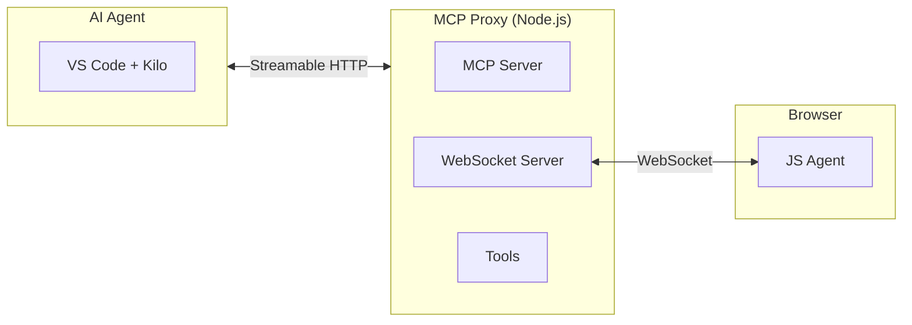

# MCP Reverse Engineering Toolkit

> **Unlock the power of AI-driven web research** — A professional platform for reverse-engineering websites through AI agents, powered by Model Context Protocol.

[](https://github.com/your-org/mcp-reverse-engineering-toolkit/actions)
[](LICENSE)
[](https://nodejs.org/)
[](package.json)

---

## Overview

**MCP Reverse Engineering Toolkit** is a browser-in-the-loop research platform that enables AI agents to interact with live web applications in real time. It bridges the gap between AI assistants and the modern web by providing a secure, extensible communication channel through the **Model Context Protocol (MCP)**.

The toolkit consists of two lightweight components:

| Component | Description |
|-----------|-------------|
| **MCP Proxy** | A Node.js server exposing MCP tools via Streamable HTTP, and a WebSocket bridge to the browser |
| **JS Agent** | A browser-injected script that executes commands inside the target website's runtime |

Designed for security researchers, QA engineers, and AI-powered automation workflows.

---

## Key Features

- **MCP-Native Architecture** — First-class integration with any MCP-compatible AI agent (VS Code + Kilo, Claude Desktop, etc.)
- **Real-Time Browser Interaction** — WebSocket-based communication for instant DOM reading and JavaScript execution
- **Self-Updating JS Agent** — Hot-reload agent code in the browser without page refresh
- **Extensible Tool System** — Plug-and-play MCP tools with a clean, modular architecture
- **Comprehensive Test Coverage** — Vitest-based test suite ensuring reliability across all modules
- **Safe Execution Environment** — All JS execution wrapped in try/catch with timeout protection and stack trace capture
- **Automatic Reconnection** — Exponential backoff (1s → 2s → 4s → ... → 60s) for resilient WebSocket connections

---

## Architecture



### How It Works

1. **AI Agent** sends MCP tool requests to **MCP Proxy** over Streamable HTTP (`http://localhost:3100/mcp`)
2. **MCP Proxy** translates MCP calls into WebSocket commands forwarded to the **JS Agent**
3. **JS Agent** (running in the browser tab) executes commands in the page context and returns results
4. Results flow back through the same pipeline to the AI Agent

---

## Quick Start

Get up and running in three steps:

### 1. Install Dependencies

```bash
npm install
```

### 2. Start MCP Proxy

```bash
npm start
```

You should see:
```
WebSocket server listening on ws://localhost:3101
MCP server listening on http://localhost:3100/mcp
Health check: http://localhost:3100/health
```

### 3. Inject JS Agent into Browser

1. Open your target website in the browser
2. Press `F12` to open Developer Tools → Console tab
3. Copy and paste the contents of `dist/js-agent-bundle.js`
4. Press `Enter` — the agent is now connected

For detailed setup instructions, see [SETUP.md](SETUP.md).

---

## MCP Tools

The following tools are available to the AI agent:

| Tool | Description |
|------|-------------|
| `read-dom` | Read the DOM of the current page (optionally filtered by CSS selector) |
| `execute-js` | Execute arbitrary JavaScript in the page context with safe error handling |
| `get-context` | Retrieve browser context data (URL, cookies, localStorage, etc.) |
| `update-agent` | Update the JS Agent code at runtime or query its current version |

---

## Project Structure

```
mcp-reverse-engineering-toolkit/
├── AGENTS.md               # Rules and conventions for AI agents
├── research-technics.md    # Study Mode workflow and research techniques
├── SETUP.md                # Step-by-step installation guide
├── package.json            # Project manifest and scripts
├── src/
│   ├── mcp-proxy/          # MCP Proxy server (Node.js)
│   │   ├── index.js        # Entry point
│   │   ├── websocket-bridge.js  # WebSocket bridge to JS Agent
│   │   ├── config.js       # Configuration
│   │   └── tools/          # MCP tool implementations
│   └── js-agent/           # JS Agent sources (ES modules)
│       ├── connection.js   # WebSocket connection with reconnection
│       ├── command-handler.js  # Command routing
│       ├── executor.js     # Safe JS execution engine
│       └── self-update.js  # Runtime code update capability
├── tests/                  # Vitest test suite
├── scripts/                # Build and startup scripts
├── dist/                   # Built JS Agent bundle
└── study/                  # Research artifacts (not committed)
```

---

## Development

### Prerequisites

- **Node.js** >= 18

### Available Scripts

| Command | Description |
|---------|-------------|
| `npm start` | Start MCP Proxy on port 3100 |
| `npm test` | Run the full test suite |
| `npm run test:watch` | Run tests in watch mode |
| `npm run build:agent` | Build JS Agent bundle to `dist/js-agent-bundle.js` |

### Code Style

- JavaScript with ES modules (no TypeScript, no CommonJS)
- 2-space indentation, async/await throughout
- All functions and modules covered by tests (minimum 80% coverage)

See [AGENTS.md](AGENTS.md) for detailed coding conventions and development rules.

---

## Documentation

| Document | Description |
|----------|-------------|
| [AGENTS.md](AGENTS.md) | Core development rules, architecture, and coding standards |
| [research-technics.md](research-technics.md) | Study Mode workflow, MCP tools reference, and research best practices |
| [SETUP.md](SETUP.md) | Step-by-step installation and configuration guide |

---

## Contributing

Contributions are welcome! Please read [AGENTS.md](AGENTS.md) for development guidelines before submitting changes.

1. Fork the repository
2. Create a feature branch (`git checkout -b feature/your-feature`)
3. Make your changes and add tests
4. Run `npm test` to verify everything passes
5. Submit a pull request

---

## License

This project is licensed under the MIT License — see the [LICENSE](LICENSE) file for details.

---

<p align="center">
  Built for the AI research community
</p>
