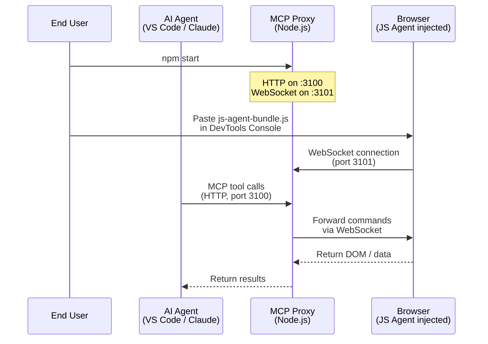

# MCP Reverse-Engineering Toolkit -- Setup Guide

This guide walks you through installing and running the MCP Reverse-Engineering Toolkit, a platform that enables an AI agent to inspect and interact with any web page in your browser.

---

## Table of Contents

1. [Overview](#overview)
2. [Prerequisites](#prerequisites)
3. [Installation](#installation)
4. [Starting MCP Proxy](#starting-mcp-proxy)
5. [Injecting JS Agent into Your Browser](#injecting-js-agent-into-your-browser)
6. [Connecting Your AI Agent](#connecting-your-ai-agent)
7. [Verifying the Connection](#verifying-the-connection)
8. [Troubleshooting](#troubleshooting)
9. [Quick Reference](#quick-reference)

---

## Overview

The toolkit consists of two components that work together:

- **MCP Proxy** -- A Node.js server running on your machine. It exposes MCP tools over HTTP and maintains a WebSocket bridge to the browser.
- **JS Agent** -- A JavaScript bundle injected into the browser developer console. It connects back to MCP Proxy and executes commands against the loaded web page.

The following diagram illustrates the data flow between components:



---

## Prerequisites

Before installing, ensure your system meets the following requirements.

| Requirement | Minimum Version | How to Check |
|---|---|---|
| Node.js | 18.0.0 | `node --version` |
| npm | 9.0.0 | `npm --version` |

### Installing Node.js

If Node.js is not installed, download it from [nodejs.org](https://nodejs.org/). Use the LTS (Long Term Support) release.

After installation, verify the version:

```bash
node --version
```

You should see output similar to `v18.19.0` or higher. If the command is not recognized, restart your terminal or check that Node.js was added to your system PATH.

---

## Installation

Follow these steps to install the toolkit and its dependencies.

### Step 1: Obtain the Source Code

Clone the repository or extract the downloaded archive:

```bash
git clone <repository-url>
cd mcp-reverse-engineering-toolkit
```

### Step 2: Install Dependencies

```bash
npm install
```

This installs all runtime dependencies (`@modelcontextprotocol/sdk`, `ws`, `express`, `zod`) and the test framework (`vitest`).

### Step 3: Build the JS Agent Bundle

```bash
npm run build:agent
```

This produces `dist/js-agent-bundle.js`, the file you will inject into your browser. Rebuild whenever the source files under `src/js-agent/` change.

---

## Starting MCP Proxy

Start the MCP Proxy server:

```bash
npm start
```

Expected output:

```
MCP server listening on http://localhost:3100/mcp
WebSocket server listening on ws://localhost:3101
Health check: http://localhost:3100/health
```

Leave this terminal window open. The server must remain running for the AI agent to communicate with the browser.

### Port Configuration

By default, MCP Proxy uses the following ports:

| Service | Default Port | Environment Variable |
|---|---|---|
| HTTP / MCP | 3100 | `EXPRESS_PORT` |
| WebSocket | 3101 | `WS_PORT` |

To override, set the environment variable before starting:

```bash
# Windows (cmd)
set EXPRESS_PORT=4000
npm start

# Windows (PowerShell)
$env:EXPRESS_PORT=4000
npm start

# Linux / macOS
EXPRESS_PORT=4000 npm start
```

---

## Injecting JS Agent into Your Browser

The JS Agent must be injected into each browser tab where you want the AI agent to operate. This is a one-time action per tab (re-inject after page reload).

### Step-by-Step Instructions

1. **Open the target website** in Chrome, Edge, Firefox, or another Chromium-based browser.
2. **Open Developer Tools**:
   - Press `F12`, or
   - Press `Ctrl+Shift+I` (Windows/Linux) / `Cmd+Option+I` (macOS), or
   - Right-click on the page and select **Inspect**.
3. **Navigate to the Console tab** in Developer Tools.
4. **Open the bundle file** `dist/js-agent-bundle.js` in any text editor.
5. **Select all content** (`Ctrl+A`), **copy** (`Ctrl+C`), then **paste into the Console** (`Ctrl+V`) and press `Enter`.
6. **Verify connection** -- you should see:

   ```
   [JS-Agent] Connected to MCP Proxy. Version: 0.1.0
   ```

If you see this message, the JS Agent is connected and ready. The AI agent can now inspect the page.

> **Note:** Closing the tab or refreshing the page disconnects the JS Agent. Re-inject the bundle to restore the connection.

---

## Connecting Your AI Agent

Configure your AI agent to connect to the MCP Proxy as an MCP server. The endpoint is:

```
http://localhost:3100/mcp
```

### Pre-connection Checklist

Before configuring your AI agent, verify that the MCP Proxy is ready to accept connections.

1. **MCP Proxy is running** -- Ensure `npm start` is executing in a terminal window and you see the startup messages:

   ```
   MCP server listening on http://localhost:3100/mcp
   WebSocket server listening on ws://localhost:3101
   ```

2. **Health endpoint responds** -- Open `http://localhost:3100/health` in your browser. The response should be:

   ```json
   { "status": "ok", "wsClients": 1, "version": "0.1.0" }
   ```

3. **JS Agent is connected** -- Confirm that `wsClients` is greater than `0`. A value of `0` means no browser tab has injected the JS Agent yet. See [Injecting JS Agent into Your Browser](#injecting-js-agent-into-your-browser).

### VS Code with Roo / Kilo

Roo and Kilo support MCP servers through the VS Code settings interface.

#### Step 1: Open MCP Settings

1. Open **File** > **Preferences** > **Settings** (or press `Ctrl+,` on Windows/Linux, `Cmd+,` on macOS).
2. In the search bar at the top, type `mcp`.
3. Scroll down to the **MCP Servers** section and click **Edit in settings.json**.

#### Step 2: Locate the Settings File

The settings file lives at the following path depending on your platform:

| Platform | Path |
|---|---|
| Windows | `%APPDATA%\Code\User\settings.json` |
| macOS | `~/Library/Application Support/Code/User/settings.json` |
| Linux | `~/.config/Code/User/settings.json` |

#### Step 3: Add the MCP Server Configuration

Add the following JSON object inside the top-level `{}` of `settings.json`:

```json
{
  "mcpServers": {
    "mcp-reverse-engineering-toolkit": {
      "type": "streamable-http",
      "url": "http://localhost:3100/mcp"
    }
  }
}
```

**Field explanation:**

| Field | Value | Description |
|---|---|---|
| `mcpServers` | (object) | Top-level key for MCP server definitions |
| `mcp-reverse-engineering-toolkit` | (string) | Human-readable identifier for this server. You may change this to any name you prefer |
| `type` | `"streamable-http"` | Transport protocol. Must match what MCP Proxy exposes |
| `url` | `"http://localhost:3100/mcp"` | HTTP endpoint of the MCP Proxy. Change the port if you use a custom `EXPRESS_PORT` |

#### Step 4: Save and Restart

1. Save the file (`Ctrl+S` / `Cmd+S`).
2. Reload the VS Code window: **Developer: Reload Window** from the command palette (`F1`), or simply restart VS Code.

#### Step 5: Confirm Tools Loaded

After reload, open the chat panel and check that the following tools appear in the available tools list:

- `read-dom`
- `execute-js`
- `get-context`
- `update-agent`

If the tools do not appear, verify the configuration syntax and check the MCP Proxy logs at `logs/mcp-proxy.log`.

### Claude Desktop

Claude Desktop uses a separate configuration file for MCP servers.

#### Step 1: Locate the Configuration File

The file `claude_desktop_config.json` lives at the following path depending on your platform:

| Platform | Path |
|---|---|
| Windows | `%LOCALAPPDATA%\Claude\claude_desktop_config.json` |
| macOS | `~/Library/Application Support/Claude/claude_desktop_config.json` |
| Linux | `~/.config/Claude/claude_desktop_config.json` |

If the file does not exist, create it.

#### Step 2: Add the MCP Server Configuration

Add the following JSON object inside the top-level `{}`:

```json
{
  "mcpServers": {
    "mcp-reverse-engineering-toolkit": {
      "transport": "streamable-http",
      "url": "http://localhost:3100/mcp"
    }
  }
}
```

**Field explanation:**

| Field | Value | Description |
|---|---|---|
| `mcpServers` | (object) | Top-level key for MCP server definitions |
| `mcp-reverse-engineering-toolkit` | (string) | Human-readable identifier for this server |
| `transport` | `"streamable-http"` | Transport protocol. Note that Claude Desktop uses `transport` instead of `type` |
| `url` | `"http://localhost:3100/mcp"` | HTTP endpoint of the MCP Proxy |

#### Step 3: Restart Claude Desktop

Fully quit and restart Claude Desktop for the configuration to take effect. On Windows, right-click the tray icon and select **Quit**. On macOS, use **Cmd+Q**.

#### Step 4: Verify the Server Appears

Open a new conversation in Claude Desktop and check that the MCP server is listed in the active servers section. The tools should be available for invocation.

### Configuration Reference

The following table describes all configuration fields used when connecting to MCP Proxy.

| Field | Required | Default | Description |
|---|---|---|---|
| `type` / `transport` | Yes | -- | Transport protocol. Must be `"streamable-http"` for MCP Proxy. Note: VS Code uses `type`, Claude Desktop uses `transport` |
| `url` | Yes | -- | Full HTTP URL to the MCP endpoint. Must include the `/mcp` path suffix |

There are no optional fields for the basic connection. If you changed the default port via the `EXPRESS_PORT` environment variable, update the `url` to match your custom port. For example, if you set `EXPRESS_PORT=4000`, the URL becomes:

```json
{
  "url": "http://localhost:4000/mcp"
}
```

### Post-connection Verification

After your AI agent connects to MCP Proxy, perform the following verification steps.

1. **Check that tools are available** -- In your AI agent interface, request a list of available tools or attempt to invoke one. The tools should appear without errors.

2. **Test with a simple tool call** -- Ask your AI agent to invoke `get-context` with no parameters. A successful response will return data from the JS Agent, such as the current page URL:

   ```
   Invoke get-context to check connectivity.
   ```

   Expected result: A JSON object containing the page context (URL, cookies, localStorage keys, etc.).

3. **Verify DOM reading works** -- Ask your AI agent to invoke `read-dom` with no selector. The response should contain the HTML of the loaded page.

If any tool call fails, proceed to the troubleshooting section below.

### MCP-Specific Troubleshooting

#### Wrong transport type

**Symptom:** The AI agent reports that the MCP server rejected the connection or tools are not available.

**Solution:**
- For VS Code: Ensure the field is named `type` and set to `"streamable-http"`.
- For Claude Desktop: Ensure the field is named `transport` and set to `"streamable-http"`.
- Do not use `"stdio"` or `"sse"` -- MCP Proxy only supports `streamable-http`.

#### Server not initialized

**Symptom:** Tool calls fail with an error indicating the server is not ready.

**Solution:**
- Wait a few seconds after starting MCP Proxy before connecting. The server needs time to initialize.
- Check `logs/mcp-proxy.log` for initialization errors.

#### Connection refused

**Symptom:** `ECONNREFUSED` or "could not connect to MCP server".

**Solution:**
- Verify MCP Proxy is running (`npm start` in a terminal).
- Confirm the URL in your configuration matches the actual port. If you changed `EXPRESS_PORT`, update the `url` field.
- Check that nothing is blocking `localhost:3100` (firewall, proxy settings).

#### Logs for diagnosis

All MCP Proxy activity is logged to `logs/mcp-proxy.log`. To diagnose connection issues:

```bash
# Windows
type logs\mcp-proxy.log

# Linux / macOS
tail -f logs/mcp-proxy.log
```

Look for entries tagged with `MCP-Proxy` or `Tool:*` that correspond to the time of the failed tool call.

---

## Verifying the Connection

Confirm everything is working by opening the health check endpoint in your browser:

```
http://localhost:3100/health
```

Expected response:

```json
{ "status": "ok", "wsClients": 1, "version": "0.1.0" }
```

The `wsClients` field indicates how many JS Agents are currently connected. A value of `1` means one browser tab is connected.

---

## Troubleshooting

### MCP Proxy will not start

**Symptom:** `npm start` fails or exits immediately.

**Solution:**
- Verify Node.js version: `node --version` must be 18 or higher.
- Check that dependencies are installed: run `npm install` again.
- Check if port 3100 is already in use by another process.

### JS Agent fails to connect

**Symptom:** No `[JS-Agent] Connected` message appears in the browser console after injection.

**Solution:**
- Confirm MCP Proxy is running (check the terminal where `npm start` was executed).
- Verify the health endpoint: `http://localhost:3100/health` should return a valid JSON response.
- Ensure you are using the latest `dist/js-agent-bundle.js`. Rebuild with `npm run build:agent` if needed.

### WebSocket connection error in browser console

**Symptom:** `WebSocket connection to 'ws://localhost:3101/' failed`

**Solution:**
- MCP Proxy is not running. Start it with `npm start`.
- If you changed the WebSocket port via `WS_PORT`, verify the JS Agent bundle was rebuilt after the change.

### AI agent cannot invoke tools

**Symptom:** The AI agent reports MCP tool calls failing.

**Solution:**
- Verify the MCP server URL is `http://localhost:3100/mcp` (not `ws://` and not a different port).
- Ensure the transport type is set to `streamable-http`.
- Check that MCP Proxy logs (in `logs/mcp-proxy.log`) do not show errors.

### Port conflicts

**Symptom:** `EADDRINUSE` error on startup.

**Solution:**
- Change the port using environment variables (see [Port Configuration](#port-configuration)).
- Or stop the process currently using the port.

---

## Quick Reference

| Action | Command |
|---|---|
| Install dependencies | `npm install` |
| Build JS Agent bundle | `npm run build:agent` |
| Start MCP Proxy | `npm start` |
| Run tests | `npm test` |
| Health check URL | `http://localhost:3100/health` |
| MCP endpoint URL | `http://localhost:3100/mcp` |
| Stop MCP Proxy | Press `Ctrl+C` in the terminal |

### Stopping MCP Proxy

To stop the server, press `Ctrl+C` in the terminal where it is running. The server will perform a graceful shutdown and close all WebSocket connections.

---

## Log Files

MCP Proxy writes logs to `logs/mcp-proxy.log`. To view the log:

```bash
# Windows
type logs\mcp-proxy.log

# Linux / macOS
tail -f logs/mcp-proxy.log
```

Log entries follow the format: `[ISO-8601 timestamp] [level] [tag] message`
