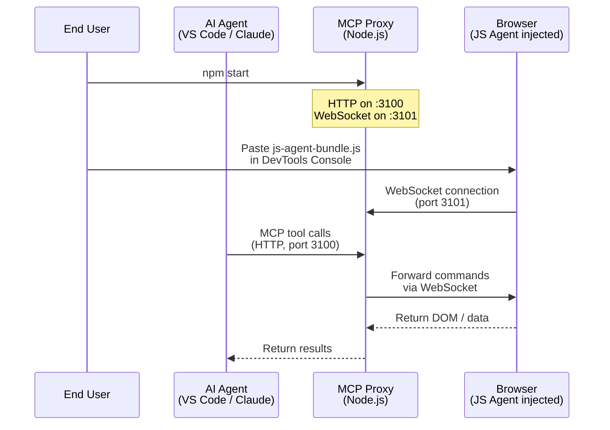

# MCP Reverse-Engineering Toolkit -- Setup Guide

This guide walks you through installing and running the MCP Reverse-Engineering Toolkit, a platform that enables an AI agent to inspect and interact with any web page in your browser.

---

## Table of Contents

1. [Overview](#overview)
2. [Prerequisites](#prerequisites)
3. [Installation](#installation)
4. [Starting MCP Proxy](#starting-mcp-proxy)
5. [Injecting JS Agent into Your Browser](#injecting-js-agent-into-your-browser)
6. [Connecting Your AI Agent](#connecting-your-ai-agent)
7. [Verifying the Connection](#verifying-the-connection)
8. [Troubleshooting](#troubleshooting)
9. [Quick Reference](#quick-reference)

---

## Overview

The toolkit consists of two components that work together:

- **MCP Proxy** -- A Node.js server running on your machine. It exposes MCP tools over HTTP and maintains a WebSocket bridge to the browser.
- **JS Agent** -- A JavaScript bundle injected into the browser developer console. It connects back to MCP Proxy and executes commands against the loaded web page.

The following diagram illustrates the data flow between components:



---

## Prerequisites

Before installing, ensure your system meets the following requirements.

| Requirement | Minimum Version | How to Check |
|---|---|---|
| Node.js | 18.0.0 | `node --version` |
| npm | 9.0.0 | `npm --version` |

### Installing Node.js

If Node.js is not installed, download it from [nodejs.org](https://nodejs.org/). Use the LTS (Long Term Support) release.

After installation, verify the version:

```bash
node --version
```

You should see output similar to `v18.19.0` or higher. If the command is not recognized, restart your terminal or check that Node.js was added to your system PATH.

---

## Installation

Follow these steps to install the toolkit and its dependencies.

### Step 1: Obtain the Source Code

Clone the repository or extract the downloaded archive:

```bash
git clone <repository-url>
cd mcp-reverse-engineering-toolkit
```

### Step 2: Install Dependencies

```bash
npm install
```

This installs all runtime dependencies (`@modelcontextprotocol/sdk`, `ws`, `express`, `zod`) and the test framework (`vitest`).

### Step 3: Build the JS Agent Bundle

```bash
npm run build:agent
```

This produces `dist/js-agent-bundle.js`, the file you will inject into your browser. Rebuild whenever the source files under `src/js-agent/` change.

---

## Starting MCP Proxy

Start the MCP Proxy server:

```bash
npm start
```

Expected output:

```
MCP server listening on http://localhost:3100/mcp
WebSocket server listening on ws://localhost:3101
Health check: http://localhost:3100/health
```

Leave this terminal window open. The server must remain running for the AI agent to communicate with the browser.

### Port Configuration

By default, MCP Proxy uses the following ports:

| Service | Default Port | Environment Variable |
|---|---|---|
| HTTP / MCP | 3100 | `EXPRESS_PORT` |
| WebSocket | 3101 | `WS_PORT` |

To override, set the environment variable before starting:

```bash
# Windows (cmd)
set EXPRESS_PORT=4000
npm start

# Windows (PowerShell)
$env:EXPRESS_PORT=4000
npm start

# Linux / macOS
EXPRESS_PORT=4000 npm start
```

---

## Injecting JS Agent into Your Browser

The JS Agent must be injected into each browser tab where you want the AI agent to operate. This is a one-time action per tab (re-inject after page reload).

### Step-by-Step Instructions

1. **Open the target website** in Chrome, Edge, Firefox, or another Chromium-based browser.
2. **Open Developer Tools**:
   - Press `F12`, or
   - Press `Ctrl+Shift+I` (Windows/Linux) / `Cmd+Option+I` (macOS), or
   - Right-click on the page and select **Inspect**.
3. **Navigate to the Console tab** in Developer Tools.
4. **Open the bundle file** `dist/js-agent-bundle.js` in any text editor.
5. **Select all content** (`Ctrl+A`), **copy** (`Ctrl+C`), then **paste into the Console** (`Ctrl+V`) and press `Enter`.
6. **Verify connection** -- you should see:

   ```
   [JS-Agent] Connected to MCP Proxy. Version: 0.1.0
   ```

If you see this message, the JS Agent is connected and ready. The AI agent can now inspect the page.

> **Note:** Closing the tab or refreshing the page disconnects the JS Agent. Re-inject the bundle to restore the connection.

---

## Connecting Your AI Agent

Configure your AI agent to connect to the MCP Proxy as an MCP server. The endpoint is:

```
http://localhost:3100/mcp
```

### VS Code with Roo / Kilo

Add the following to your MCP settings:

```json
{
  "mcpServers": {
    "mcp-reverse-engineering-toolkit": {
      "type": "streamable-http",
      "url": "http://localhost:3100/mcp"
    }
  }
}
```

### Claude Desktop

Add the following to `claude_desktop_config.json`:

```json
{
  "mcpServers": {
    "mcp-reverse-engineering-toolkit": {
      "transport": "streamable-http",
      "url": "http://localhost:3100/mcp"
    }
  }
}
```

### Available MCP Tools

Once connected, the AI agent has access to the following tools:

| Tool | Description |
|---|---|
| `read-dom` | Read the page DOM, optionally filtered by CSS selector |
| `execute-js` | Execute arbitrary JavaScript in the page context |
| `get-context` | Retrieve data from the JS agent (URL, cookies, localStorage, etc.) |
| `update-agent` | Update the JS agent code or retrieve its current version |

---

## Verifying the Connection

Confirm everything is working by opening the health check endpoint in your browser:

```
http://localhost:3100/health
```

Expected response:

```json
{ "status": "ok", "wsClients": 1, "version": "0.1.0" }
```

The `wsClients` field indicates how many JS Agents are currently connected. A value of `1` means one browser tab is connected.

---

## Troubleshooting

### MCP Proxy will not start

**Symptom:** `npm start` fails or exits immediately.

**Solution:**
- Verify Node.js version: `node --version` must be 18 or higher.
- Check that dependencies are installed: run `npm install` again.
- Check if port 3100 is already in use by another process.

### JS Agent fails to connect

**Symptom:** No `[JS-Agent] Connected` message appears in the browser console after injection.

**Solution:**
- Confirm MCP Proxy is running (check the terminal where `npm start` was executed).
- Verify the health endpoint: `http://localhost:3100/health` should return a valid JSON response.
- Ensure you are using the latest `dist/js-agent-bundle.js`. Rebuild with `npm run build:agent` if needed.

### WebSocket connection error in browser console

**Symptom:** `WebSocket connection to 'ws://localhost:3101/' failed`

**Solution:**
- MCP Proxy is not running. Start it with `npm start`.
- If you changed the WebSocket port via `WS_PORT`, verify the JS Agent bundle was rebuilt after the change.

### AI agent cannot invoke tools

**Symptom:** The AI agent reports MCP tool calls failing.

**Solution:**
- Verify the MCP server URL is `http://localhost:3100/mcp` (not `ws://` and not a different port).
- Ensure the transport type is set to `streamable-http`.
- Check that MCP Proxy logs (in `logs/mcp-proxy.log`) do not show errors.

### Port conflicts

**Symptom:** `EADDRINUSE` error on startup.

**Solution:**
- Change the port using environment variables (see [Port Configuration](#port-configuration)).
- Or stop the process currently using the port.

---

## Quick Reference

| Action | Command |
|---|---|
| Install dependencies | `npm install` |
| Build JS Agent bundle | `npm run build:agent` |
| Start MCP Proxy | `npm start` |
| Run tests | `npm test` |
| Health check URL | `http://localhost:3100/health` |
| MCP endpoint URL | `http://localhost:3100/mcp` |
| Stop MCP Proxy | Press `Ctrl+C` in the terminal |

### Stopping MCP Proxy

To stop the server, press `Ctrl+C` in the terminal where it is running. The server will perform a graceful shutdown and close all WebSocket connections.

---

## Log Files

MCP Proxy writes logs to `logs/mcp-proxy.log`. To view the log:

```bash
# Windows
type logs\mcp-proxy.log

# Linux / macOS
tail -f logs/mcp-proxy.log
```

Log entries follow the format: `[ISO-8601 timestamp] [level] [tag] message`
