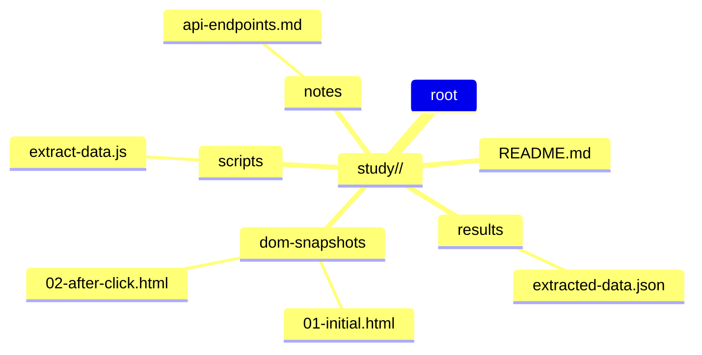
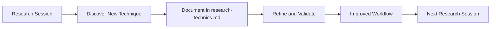

# Research Techniques — Study Mode Workflow

This document contains the complete workflow, tools, and best practices for conducting website research using the mcp-reverse-engineering-toolkit. It is intended for AI agents operating in **Study Mode**.

---

## 1. Study Mode Rules

**Allowed:** Create and modify files only inside `study/<project-name>/`.

**Forbidden:**
- Modify any files in `src/`, `tests/`, `scripts/`
- Modify root config files: `package.json`, `AGENTS.md`, `.gitignore`

**Exception:** If research reveals a need to improve the core framework, file it as a separate Core Development task.

---

## 2. Starting Research

When asked to research a website, the AI agent must:

1. **Ensure MCP Proxy is running** — Execute `GET http://localhost:3100/health` (via webfetch or curl). Expected response: `{ "status": "ok", "wsClients": <number>, "version": "0.1.0" }`. If the server does not respond, ask the user to open a terminal, navigate to the project folder, and run `npm start`.
2. **Ensure JS Agent is connected** — Check that `wsClients > 0` in the health response. If `wsClients === 0`, ask the user to open the browser console (F12) on the target site, copy the code from `dist/js-agent-bundle.js`, and paste it into the console.
3. **Create a research folder** — `study/<project-name>/` (name based on URL: `study/example-com/` for `https://example.com`).
4. **Begin data collection** via MCP tools, following the steps below.

---

## 3. Monitoring MCP Proxy via Logging

MCP Proxy has a built-in logging system. Each output line has the format:

```
[ISO-8601-timestamp] [level] [tag] message (optional JSON data)
```

### Logging Levels

| Level | When Used |
|-------|-----------|
| `info` | Normal events: client connections, sending/receiving requests, tool registration |
| `debug` | Detailed diagnostics: ping/pong keepalive, message parsing |
| `warn` | Warnings: unknown request IDs, parameter validation |
| `error` | Errors: timeouts, agent errors, connection drops |

### Tags

| Tag | Source |
|-----|--------|
| `MCP-Proxy` | Main process: startup, MCP requests, shutdown |
| `WS-Bridge` | WebSocket layer: connections, request routing, keepalive |
| `Tool:read-dom` | read-dom tool |
| `Tool:execute-js` | execute-js tool |
| `Tool:get-context` | get-context tool |
| `Tool:update-agent` | update-agent tool |

### Useful Diagnostic Log Examples

```
# Request successfully sent and received
[info] [WS-Bridge] Sending GET_CONTEXT to agent {"timeout":30000,"params":{"keys":["url","title"]}}
[info] [WS-Bridge] Response received for request 3e543c45... {"hasError":false,"hasResult":true}

# Timeout — JS Agent did not respond
[error] [WS-Bridge] Request GET_CONTEXT timed out after 30000ms

# JS Agent not connected
[error] [WS-Bridge] No JS Agent connected for READ_DOM

# MCP request from AI agent
[info] [MCP-Proxy] MCP request: POST /mcp
[info] [MCP-Proxy] MCP request handled, response status: 200
```

**Important:** If an MCP tool returns a timeout error, check the MCP Proxy terminal output — the logs will show whether the request was sent to the agent, whether the server received a response, and why the promise did not resolve.

**Log file:** All logs are written to `logs/mcp-proxy.log`. To view recent lines:
```bash
# Windows
type logs\mcp-proxy.log
# Linux/Mac/git-bash
tail -20 logs/mcp-proxy.log
```

---

## 4. Reconnecting MCP Tools After Server Restart

After MCP Proxy restarts (e.g., after code changes), the MCP session in VS Code becomes invalid and MCP tools return `"Server not initialized"` (HTTP 400). In this case:

1. Reconnect the MCP tool in VS Code (restart the extension or re-open the workspace)
2. Ensure the JS agent in the browser reconnected (check `wsClients > 0` in the health endpoint)
3. Only then call MCP tools

---

## 5. MCP Tools — Detailed Description

### 5.1. read-dom (selector?, timeout?)

Reads the page DOM. The most frequently used tool.

| Parameter | Type | Required | Default | Description |
|-----------|------|:---:|:---:|-------------|
| selector | string | no | entire document | CSS selector for filtering elements |
| timeout | number | no | 5000 | Maximum wait time (ms) |

**Example requests (as made by the AI agent):**

```
// Read entire DOM
read-dom

// Read a specific element
read-dom selector="#main-content"

// Read a list
read-dom selector="div.product-card"
```

**Returns:** HTML string of selected elements.

**Important:** The DOM can be very large. Start with selectors for specific parts of the page; do not read the entire DOM unless necessary.

### 5.2. execute-js (code: string)

Executes arbitrary JavaScript code in the page context.

| Parameter | Type | Required | Description |
|-----------|------|:---:|-------------|
| code | string | yes | JavaScript code to execute |

**Example requests:**

```
// Check global variables
execute-js code="Object.keys(window).filter(k => k.startsWith('__'))"

// Get data from a React component
execute-js code="document.querySelector('#root').__reactFiber$*"

// Modify something on the page
execute-js code="document.querySelector('.paywall').remove()"

// Read fetch responses
execute-js code="performance.getEntriesByType('resource').map(e => e.name)"
```

**Returns:** JSON representation of the execution result. If the code returned undefined, null will be returned. Errors are returned with a full stack trace.

**Error handling:** Any JS errors (syntax, runtime, timeout) are returned with a message and stack trace. The AI agent must analyze errors and correct the code.

### 5.3. get-context (keys?)

Gets contextual page data from the JS agent.

| Parameter | Type | Required | Default | Description |
|-----------|------|:---:|:---:|-------------|
| keys | string[] | no | all keys | Filter for requested data |

**Available keys:**
- `url` — current page URL
- `title` — page title
- `cookies` — page cookies
- `userAgent` — browser User-Agent
- `localStorage` — localStorage contents

**Example requests:**

```
// Get everything
get-context

// Get only URL and cookies
get-context keys=["url", "cookies"]
```

### 5.4. update-agent (code?)

Updates the JS agent code (self-update) or returns the version.

| Parameter | Type | Required | Description |
|-----------|------|:---:|-------------|
| code | string | no | New JS agent code |

**Example requests:**

```
// Check version
update-agent

// Update agent (code is the full new bundle)
update-agent code="(function() { /* new agent code */ })()"
```

---

## 6. Standard Research Procedure

When researching a new site, the AI agent must follow this protocol:

### Step 1: Get Context
```
get-context
```
Learn the URL, title, and User-Agent.

### Step 2: Study Page Structure
```
read-dom selector="head"
read-dom selector="body"
```
Start with the overall structure, then drill down with selectors.

### Step 3: Investigate Key Components
```
read-dom selector=".main-content, #app, [data-page]"
```
Use execute-js to find interesting elements:
```
execute-js code="document.querySelectorAll('[class*=\"price\"], [class*=\"product\"], [data-testid]').length"
```

### Step 4: Analyze JS Environment
```
execute-js code="Object.keys(window).filter(k => typeof window[k] === 'function' && k[0] !== k[0]?.toLowerCase())"
```
Check global variables, frameworks (React, Vue, Angular), and API endpoints.

### Step 5: Interact with the Page
```
execute-js code="document.querySelector('button.submit').click()"
```
After actions — re-read the DOM to see changes.

### Step 6: Save Artifacts
Save all found data, DOM snapshots, and scripts to `study/<project-name>/`.

---

## 7. Rules for Working with execute-js

- **Code must be small and targeted** — do not write large scripts; use several small requests instead
- **Use self-contained IIFEs** — wrap complex code in `(function() { ... })()`
- **Do not mutate the page unless necessary** — if you only need to read data, do not change the DOM
- **If the page must be modified** (e.g., remove a paywall) — do so consciously and inform the user
- **Always anticipate errors** — check element existence before accessing

---

## 8. The "Stop and Ask" Technique

When research requires user action on the site (submitting a form, clicking a button, entering text, uploading a file) — **the AI agent must NOT perform this via execute-js**. Instead:

1. **Stop automatic execution** — do not attempt to emulate user actions via JS.
2. **Set up an interceptor** (if data interception is needed) — install a fetch-interceptor or mutation-observer via execute-js.
3. **Ask the user to perform the action** — use `ask_followup_question` with a clear formulation.
4. **After the user action** — read the intercepted data via execute-js.

**Example workflow:**
```
// Step 1: Set up interceptor
execute-js code="(function() { const calls = []; const orig = window.fetch; window.fetch = function(...a) { calls.push(a); return orig.apply(this, a); }; window.__getCalls = () => calls; })()"

// Step 2: Stop and ask the user
ask_followup_question "Please send a test message in the chat"

// Step 3: After user action — read intercepted data
execute-js code="window.__getCalls()"
```

**Why this matters:**
- Emulating clicks via JS may not work (SPA frameworks, event delegation)
- The user may add context (select a model, attach a file)
- Intercepting real requests gives the exact API structure

---

## 9. Artifact Storage Rules

All research artifacts are stored in `study/<project-name>/`:



---

## 10. Self-Improvement Mandate

**When applying new site research strategies, the agent MUST update itself.** This is a non-negotiable requirement for continuous improvement of the research framework.

### 10.1. Document New Techniques

After each research session, if a new technique or approach was discovered that was not previously documented:

1. Add the technique to this document (`research-technics.md`)
2. Include a clear description, example usage, and any caveats
3. Update the relevant section (e.g., add a new step to the Standard Research Procedure if applicable)

### 10.2. Update Research Workflow

If the research reveals gaps in the current workflow:

1. Propose concrete improvements to the Standard Research Procedure (Section 6)
2. Update the MCP Tools description if new patterns emerge
3. Refine the "Stop and Ask" technique guidelines based on real-world experience

### 10.3. Improve Knowledge Base

After each research session:

1. Create or update `study/<project-name>/README.md` with lessons learned
2. Document site-specific patterns in `study/<project-name>/notes/`
3. If a technique is reusable across sites, promote it to this document

### 10.4. Feedback Loop

The research process follows this feedback loop:



**Key principle:** Each research session should leave the framework smarter than it was before. The agent is expected to actively contribute to this improvement, not just consume existing documentation.

---

## 11. Quick Reference

| Task | Tool | Example |
|------|------|---------|
| Get page info | `get-context` | `get-context keys=["url", "title"]` |
| Read DOM | `read-dom` | `read-dom selector="#app"` |
| Execute JS | `execute-js` | `execute-js code="console.log(window)"` |
| Check agent version | `update-agent` | `update-agent` |
| View logs | CLI | `tail -20 logs/mcp-proxy.log` |
| Health check | HTTP | `GET http://localhost:3100/health` |

---

_For general development rules, code style, testing, and project architecture, see [AGENTS.md](AGENTS.md)._